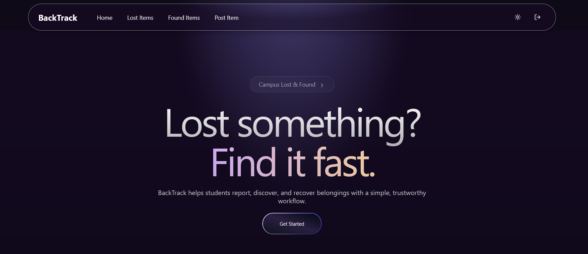

# BackTrack — Campus Find



A lightweight Vite + React + TypeScript app for posting and searching lost & found items on campus. Built with modern UI primitives (shadcn/radix + Tailwind), Supabase for backend/auth/storage, and an optional OpenRouter integration for smart keyword extraction.

## Table of contents

- What is this
- Tech stack
- Quick start
- Environment variables
- Available scripts
- Project structure
- Supabase & migrations
- Contributing
- License & contact

## What is this

BackTrack is a small web application intended to help campus users post lost and found items and search for matches. It includes:

- Posting UI for lost/found items
- Search with keyword extraction (optional OpenRouter integration)
- Supabase integration for authentication, storage and database

This repository contains the frontend client (Vite + React + TypeScript).

## Tech stack

- Vite (TypeScript)
- React 18
- Tailwind CSS with shadcn/ui-style components
- Radix UI primitives
- Supabase (auth, database) via @supabase/supabase-js
- Optional OpenRouter for chat/keyword extraction

## Quick start

Requirements

- Node 18+ (or Bun) and a modern browser

Install dependencies and run locally (PowerShell):

```powershell
# Using bun (if you prefer bun)
bun install
bun run dev

# Using npm
npm install
npm run dev

# Using pnpm
pnpm install
pnpm dev
```

Open http://localhost:5173 (default Vite port) in your browser.

## Environment variables

Create a `.env` file (or set environment variables in your host). The frontend expects Vite-prefixed variables described below:

```text
VITE_SUPABASE_URL=<your-supabase-url>
VITE_SUPABASE_PUBLISHABLE_KEY=<your-supabase-anon-key>

# Optional: OpenRouter API key for smart keyword extraction
VITE_OPENROUTER_API_KEY=<your-openrouter-key>
```

- The Supabase client reads `VITE_SUPABASE_URL` and `VITE_SUPABASE_PUBLISHABLE_KEY` from `import.meta.env`.
- If you don't provide `VITE_OPENROUTER_API_KEY`, the app will fall back to local keyword heuristics.

## Available scripts

The repository `package.json` contains the following scripts:

- `dev` — start the Vite dev server
- `build` — build production assets
- `build:dev` — build with development mode
- `preview` — preview the production build locally
- `lint` — run ESLint

Run them with your package manager, e.g. `npm run dev` or `bun run dev`.

## Project structure (important folders)

- `src/` — main frontend source
	- `components/` — UI components and shadcn/radix wrappers
	- `pages/` — route-level pages (Index, Found, Lost, PostItem, Auth, NotFound)
	- `integrations/supabase/` — Supabase client and generated types
	- `services/` — small API/utility clients (e.g. `openrouter.ts`)
	- `lib/` — utilities

- `supabase/` — migrations and Supabase config (migrations are included)

Look into `src/pages` and `src/components` to extend features and add pages.

## Supabase & migrations

This project uses Supabase for the backend. Migrations are stored in the `supabase/migrations` folder. To initialize a Supabase project and run migrations locally, use the Supabase CLI (not included here).

Tips:

- Create a Supabase project, copy the `anon`/`publishable` key and URL into `.env` as Vite variables.
- Use the `supabase` folder as reference for table definitions and SQL migrations.

## Contributing

- Fork / branch from `main`.
- Keep changes small and focused; open a PR with a clear description.
- Run `npm run lint` and ensure no obvious TypeScript/ESLint errors.

If you plan to add features that touch the backend schema, include matching SQL migration files under `supabase/migrations`.

## License & contact

No license file is included in this repository. If you intend to publish this project, add a `LICENSE` file (MIT or another license) and include it in the repository root.

For questions, open an issue or reach out to the repository owner.

---

If you'd like, I can also:

- add a `.env.example` file, or
- add a short CONTRIBUTING.md and a basic LICENSE (MIT), or
- update README with screenshots or a short demo GIF if you provide images.

Tell me which of those extras you'd like next.
